```{r setup, include=FALSE}
library(learnr)
library(tidyverse)
library(openintro)
library(emo)

knitr::opts_chunk$set(echo = FALSE, message = FALSE, warning = FALSE)

# Setup for in some exercise chunks
hsb2_public <- hsb2 %>%
  filter(schtyp == "public")

avg_read <- mean(hsb2$read)
```

## Welcome

Hello, and welcome to **Getting Started with Data**!

In this tutorial we will take you through concepts and <a href="https://rguroo.com/">Rguroo</a> instructions that are essential for getting started with data analysis.

Scientists seek to answer questions using rigorous methods and careful observations. These observations form the backbone of a statistical investigation and are called data. Statistics is the study of how best to collect, analyze, and draw conclusions from data. It is helpful to put statistics in the context of a general process of investigation:

- **Step 1**: Identify a question or problem.

- **Step 2**: Collect relevant data on the topic.

- **Step 3**: Analyze the data.

- **Step 4**: Form a conclusion.

We will focus on **steps 1 and 2** of this process in this tutorial.

Our learning goals for the tutorial are *to internalize the language of data, load and view a dataset in <a href="https://rguroo.com/">Rguroo</a> and distinguish between various variable types, classify a study as observational or experimental, and determine the scope of inference, distinguish between various sampling strategies, and identify the principles of experimental design.*

This tutorial does not assume any previous experience with <a href="https://rguroo.com/">Rguroo</a>, but if you would like an introduction to Rguroo first, we recommend that you start with the [Intoduction to Rguroo](https://openintrostat.github.io/openintro-labs-rguroo/01_intro_to_rguroo/intro_to_rguroo.html) lab of the OpenIntrostat.

## Get Started with Rguroo

<a href="https://rguroo.com/">Rguroo</a> (read R-guru) is a point-and-click web-application statistical software that facilitates teaching and learning of statistical concepts. You only need the Internet and a browser to use Rguroo; no downloads, installation, or plugins are required. It is platform-independent and runs on tablets too. Rguroo’s computation engine is R. However, no knowledge of R is required to use Rguroo. If you like to get more information about Rguroo and related resources, refer to the Rguroo website https://rguroo.com/.

To begin using Rguroo, you need to create a Rguroo account by navigating to the [registration page](https://rguroo.com/register) at https://www.rguroo.com/register. You can find [instructions](https://rguroo.com/AccountCreation.html) for how to register at https://rguroo.com/AccountCreation.html. 

Upon completing your account registration, a message will be sent to the email address you used to register your Rguroo account, including a temporary password. Follow the instructions in the email to change the temporary password to your password of choice and log in to Rguroo. Once you log in, the Rguroo application page opens, and you should see a page that looks like the figure below. Now you are all set to use Rguroo. 

**Note to Canvas users**: If Rguroo is set up as a tool on your course Canvas, registration or login is not required. You simply click on the Rguroo link on Canvas to open the Rguroo application.

```{r, out.width='85%', fig.align='center', fig.cap='*The Rguroo Environment*'}
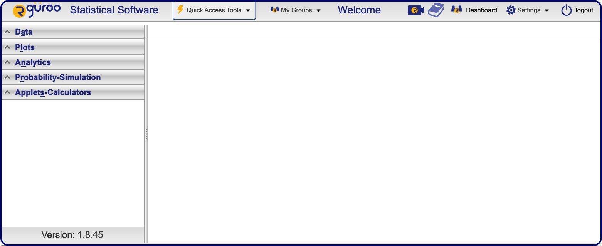
```

```
Register for your Rguroo account and log in to the Rguroo application page.
```

The sidebar on the left of the Rguroo application page consists of five toolboxes: **_Data_**, **_Plots_**, **_Analytics_**, **_Probability-Simulation_**, and **_Applets_**. You can access these toolboxes either by clicking on the toolbox name or via the keyboard shortcuts, by pressing Alt + the second letter of the toolbox name; `Alt + a` for $\it{D\underline{a}ta}$, `Alt + l` for $\it{P\underline{l}ots}$, `Alt + n` for $\it{A\underline{n}alytics}$, `Alt + r` for $\it{P\underline{r}obability-Simulation}$, and `Alt + p` for $\it{A\underline{p}plets}$. Also, a **Quick Access Tools** drop-down on the top right of the Rguroo application page provides access to frequently used functions, such as **Import Dataset**.

Within each toolbox, there are functions that you can use to perform various tasks. Moreover, Rguroo objects, such as data, graphs, and reports, that you have saved are listed in each section. We will give details of how to use each toolbox and its functions in the tutorials that follow.


## Data in Rguroo

In this lesson, we'll begin by introducing the terminology of datasets and data frames in Rguroo.

One of the datasets that we will work with in this tutorial comes from the High School and Beyond Survey, which is a survey conducted on high school seniors by the National Center of Education Statistics.

The data are organized in what we call a *data frame*, where each row represents an *observation* or a *case* and each column represents a *variable*. If you ever use spreadsheets, such as a Google sheet or Excel, this representation should be familiar to you.

In this lesson, we'll work with the High School and Beyond dataset stored in Rguroo's *Openintro Dataset Repository*. The data are stored in a *data frame* called `hsb2`. You can read more about this dataset [here](http://openintrostat.github.io/openintro/reference/hsb2.html). Below is a 
preview of the `hsb2` dataset. The next two sections will show how you can upload this dataset into your Rguroo account (environment) and browse through the data.

```{r, out.width='90%', fig.align='center', fig.cap='*Twenty cases of the hsb2 dataset*'}
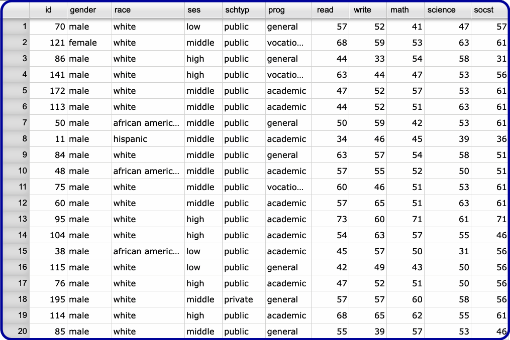
```

### Importing data into Rguroo

To work with a dataset in Rguroo, you import or upload it into your Rguroo account, depending on where the dataset is stored. You can *import* a dataset if it is in a Rguroo Dataset Repository or *upload* a dataset if it is stored in your storage medium.  Once you import or upload a dataset into your Rguroo account, it is stored on Rguroo's cloud storage and becomes available for use in all Rguroo functions. In this lesson, we're using a dataset that is included in a Rguroo Dataset Repository. Rguroo consists of several Dataset Repositories, each of which has various datasets that are conveniently accessible in Rguroo. For example, the Rguroo Dataset Repository *Openintro* consists of all the datasets we will use in these tutorials, so you won't need to worry about different ways of loading data into Rguroo. However, learning more about loading data into Rguroo is very important for when you're working on an analysis with your own data.

Some commonly used formats of data are plain text, comma-separated values (CSV), Excel files (XLS or XLSX), or RData (the file format R uses to store data). Rguroo supports uploading datasets in these formats and a few other formats. To get more information on how to upload data into Rguroo refer to [Chapter 1 of the Rguroo Users's Guide](https://rguroo.com/latest_userguide.pdf?nocache=8twlw#chapter.1), or Rguroo's [Quick Guide](https://rguroo.com/quick_userguide.html#data-import-data-repository) or watch this video [](https://youtu.be/f6kvSr89KRw).

You can import datasets from an Rguroo dataset repository into your Rguroo account in a few simple steps. 

---

Log in to your Rguroo account, and use the following steps to import the dataset `hsb2` into your Rguroo account (see figure below):

1.	Open the **_Data_** toolbox. 

2.	Select the Data Import dropdown 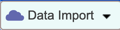 and select `Dataset Repository`. The *Repository Dataset Import* dialog opens (see figure below).

3.	In the Search Repository box, type $\color{darkblue}{\tt{open}}$. The `OpenIntro` repository's name appears on the top panel. 

4.	Select the `OpenIntro` repository on the upper panel. The names of the dataset in the repository appear in the lower panel. 

5.	In the lower panel, select `hsb2` from the list of datasets.

6.	Click on the `Import` button. You will see a pop-up window confirming that the dataset has been imported successfully.

7. Click the `Ok` button on the pop-up window. You will see the name of the dataset (`hsb2`) on the list under the Data toolbox.

8.	Click the `Close` button to close the *Repository Dataset Import* dialog.

```{r, out.width='90%', fig.align='center', fig.cap='*Rguroo dialogs to import datasets from Rguroo Dataset Repository*'}
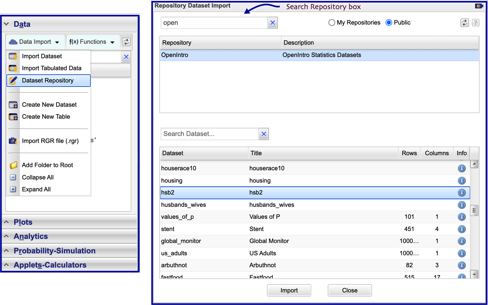
```

---

Now you have the `hsb2` in your Rguroo account!

### Take a peek

When you want to work with data in Rguroo, a good first step is to take a peek at what
the data look like. Double-click on the name of the dataset `hsb2` that appears under the **_Data_** section. This opens the Rguroo **Data Viewer**, as shown below.

```{r, out.width='90%', fig.align='center', fig.cap='*Rguroo Data Viewer, showing 17 cases of hsb2 dataset*'}
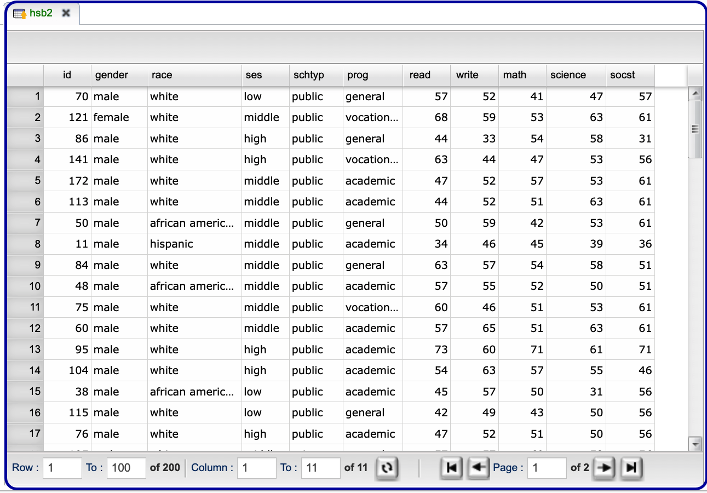
```

The names of the variables (columns) in the dataset are shown on the top row of the **Data Viewer**.  Moreover, at the bottom of the Viewer, you can see that the `hsb2` dataset has 200 observations (rows) and 11 variables (columns). You can use the text boxes and the buttons at the bottom of the Viewer to navigate to different rows and columns of the data. By default, rows 1 to 100 of the 200 rows are shown. To see specific rows, type in the values of your desired range in the `Row` and `To` text boxes, and click on the refresh button . 
Similarly, type in values in the `Column` and `To` text boxes and click on the refresh button  to see your desired columns.
You can also navigate the data page-wise by using the right and left arrows shown.


Now let's put what you've learned so far to use!

### 

Next, we’ll practice on another dataset, `email50`, which contains a subset of incoming emails for a single email account for the first three months of 2012.  We'll examine the structure of this dataset and determine the number of rows (observations) and columns (variables).

Import the `email50` from Rguroo's *OpenIntro* Dataset Repository, and then take a peek at the `email50` dataset using Rguroo's **Data Viewer**. 

*How many observations and variables are there?*

## Types of variables

When you first start working with a dataset, it's good practice to take a note of its dimensions; how many rows or observations, and how many columns or variables the data frame has.

You learned how to do this in the previous section using Rguroo's **Data Viewer**. You also learned how to take a quick look at the list of variables in the dataset. In this section, we will delve deeper into the categorization of variables as **numerical and categorical**. This is an important step, as the type of variable helps us determine what summary statistics to calculate, what type of visualizations to make, and what statistical method will be appropriate to answer the research questions we're exploring.

There are two types of variables: numerical and categorical.

- **Numerical**, in other words, quantitative variables take on numerical values. It is sensible to add, subtract, take averages, and so on, with these values.

- **Categorical**, or qualitative, variables take on a limited number of distinct categories. These categories can be identified with numbers. For example, it is customary to use Likert variables (strongly agree to strongly disagree) coded as 1 through 5, but it wouldn't be sensible to do arithmetic operations with these values. They are merely placeholders for the levels of the categorical variable.

### Numerical data

Numerical variables can be further categorized as **continuous or discrete**.

- **Continuous numerical** variables are usually measured, such as height. These variables can take on an infinite number of values within a given range.

- **Discrete numerical** variables are those that take on one of a specific set of numeric values where we are able to count or enumerate all of the possibilities. One example of a discrete variable is the number of pets in a household. In general, count data are an example of discrete variables.

When determining whether a numerical variable is continuous or discrete, it is important to think about the nature of the variable and not just the observed value, as rounding of continuous variables can make them appear to be discrete. For example, height is a continuous variable. However, we tend to report our height rounded to the nearest unit of measure, like inches or centimeters.

### Categorical data

Categorical variables that have ordered levels are called **ordinal**.

Think about a survey question where you're asked how satisfied you are with the customer service you received, and the options are very unsatisfied, unsatisfied, neutral, satisfied, and very satisfied. These levels have an inherent ordering. Hence the variable would be called ordinal.

If the levels of a categorical variable do not have an inherent ordering to them, then the variable is simply called categorical. For example, do you consume caffeine or not?

Another special type of categorical variable is called **Label/ID**. Values of a Label/ID variable identify each case uniquely. For example, social security numbers of participants in a study.

### Variables in `hsb2`

Let's take a moment to go through the variables in the High School and Beyond dataset. Rguroo internally divides variables into two types of categorical and numerical. To get information about the variables in a dataset, we right-click on the dataset name, and in the context menu that appears, you select `Dataset Summary`. The figure below shows the context menu that appears when we right-click on the dataset name `hsb2`. 


```{r, out.width='80%', fig.align='center', fig.cap='*Rguroo\'s dataset context menu includes the Dataset Summary function*'}
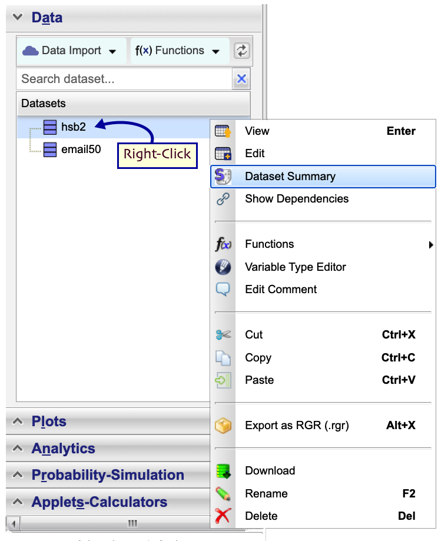
```

The following is Rguroo's dataset summary for the `hsb2` data. It separates numerical variables from categorical variables.

```{r, out.width='100%', fig.align='center', fig.cap='*Rguroo\'s dataset summary report for the hsb2 data*'}
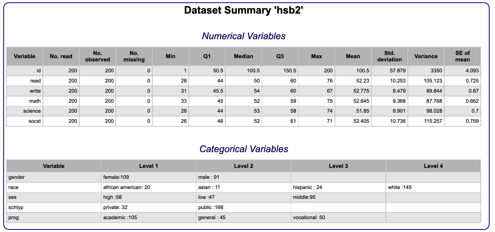
```

The first variable in the Numerical Variables list is *id*, which is an identifier variable for the student. Strictly speaking, this is a categorical variable (ID/Label variable), though the labeling of this variable is likely not that useful since we would not use this variable in an analysis of relationships between the variables in the dataset. You can think of this variable as an anonymized version of having the students' names in the dataset.

The remaining variables are scores that these students received in reading, writing, math, science, and social studies tests. Since these scores are all whole numbers, and assuming that it is not possible to obtain a non-whole number score on these tests, these variables are discrete numerical. The report also consists of other information, such as the number of observed values, the number of missing values, and various summary statistics that we will discuss later.

The first variable in the Categorical Variables list is *gender* with levels `"male"` and
`"female"`. It is also shown that there are 109 females and 91 males in the dataset. It should be noted that the language of government surveys, such as
High School and Beyond, is slow to change. So with these types of data, you will continue to see variables mislabeled as "gender" when they, in fact, measure the participant's biological sex (male, female). 

There is no inherent ordering to the levels of this variable, no matter what
anyone tells you! So, this is just a categorical variable. The same is true for
the *race* variable, which has levels of `"white"`, `"african american"`,
`"hispanic"`, and `"asian"`.

Socio-economic status (*ses*), on the other hand, has three levels `"low"`, `"middle"`,
and `"high"` that have an inherent ordering, hence this variable is an *ordinal*
categorical variable.

School type (*schtyp*) and program (*prog*) are also both categorical variables, with no inherent ordering to their levels.

Next, we will practice identifying variables in a different dataset.

###  

Recall that the **Dataset Summary**  function, available via the context menu for each dataset, gives a summary of numerical and categorical variables in a dataset. 

Let's have another look at the `email50` data, so we can practice identifying variable types. 

Use the **Dataset Summary** function to view the variables in the `email50` dataset. For a description of the variables in the `email50` dataset, click [here](https://www.openintro.org/data/index.php?data=email50).

*Review the output to identify each variable as either numerical or categorical, and further as discrete or continuous (if numerical) or ordinal or not ordinal (if categorical).*

## Categorical data in Rguroo: factors

There are various data classes in R, and hence within Rguroo. In this tutorial, we'll focus on ones that are relevant to the concepts we will introduce. One of these classes is a factor, which is what Rguroo often stores categorical variables as. An important use of factors is in statistical modeling, since categorical variables enter into models differently than numerical variables. We'll learn more about what this difference is in a later tutorial, but for now just keep in mind that while factors might crop up in places where they're not actually helpful, there are also many places where they are essential to running a statistical analysis correctly.

### Categorical Data

- Referred to as factor in Rguroo
  + Important use: statistical modeling
  + Sometimes undesirable, sometimes essential
- Common in subgroup analysis
  + Only interested in a subset of the data
  + Filter for specific levels (values) of categorical variable

A common step in many analyses that involve categorical data is a subgroup analysis, where we work with only a subset of the data. For example, analyzing data only from students in public schools or only for students who identified as female. We can obtain subsets of data by filtering for the specific levels we're interested in. In Rguroo, you can filter data using the **Subset** function in the **_Data_** toolbox. We will show how to use the **Subset** function momentarily. Another option for filtering factor variables is to use Rguroo’s **Level Editor** that exists in each function. We will explain the use of **Level Editor** in later sections. 

Now, suppose we want to do an analysis of only the students in public schools in the High School and Beyond dataset. To do so, we can create a subset of the data to filter only public school cases. As we saw in Rguroo's summary statistic report, there are 168 students in public schools and 32 in private schools. Let's see how we can get the subset of 168 students in a separate dataset.

## Rguroo's Subset function

The figure below shows dialog boxes for Rguroo's **Subset** function. Use the following steps to obtain the subset of students who attend public schools in the `hsb2` dataset.

---

1. Open the **_Data_** toolbox and click on the **Functions** dropdown .

2. Select `Subset` from the dropdown menu. This opens the **Data Subset** dialog.

3. From the `Dataset` dropdown select `hsb2`.

4. In the Row Selection section of the dialog, click on `Logical Expression`. The **Logical Expression Creator** dialog opens.

5. Using the **Logical Expression Creator** dialog, create a logical expression by clicking on the plus sign  to add an expression that specifies the public school type.

6. Create the expression as follows:   
  6.1 Under the `Variable` column, select the variable `schtyp`.  
  6.2 Under the `Op.` column select the operation `==`.  
  6.3 Under the `Value` column select the level `Public`.  
  
7. Click `Done`. This closes the **Logical Expression Creator**.

8. Click the Preview button .

---

```{r, out.width='100%', fig.align='center', fig.cap='*Using Rguroo\'s Subset function to filter public school students in the hsb2 dataset*'}
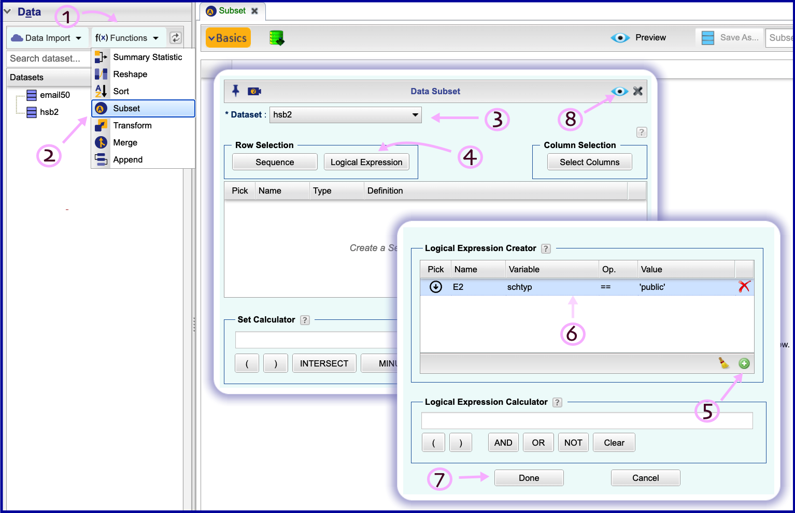
```

You should see a dataset that appears in Rguroo's **Data Viewer**. This dataset includes students only from public schools. Note that the logical expression creator is used to specify logical expressions that indicate which subset of the data we are interested in. We created the logical expression `schtyp == "public"`, which results in the subset of the data for which the variable `schtyp` is equal to `public`.

Once the data subset appears in Rguroo's **Data Viewer**, you can save it by typing a name in the `Save As` text box. Let's save the new dataset using the name `hsb2_public`.

```{r, out.width='75%', fig.align='center', fig.cap='Textbox for saving output of the Subset function'}
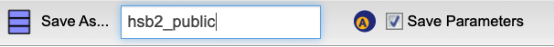
```

If you uncheck the `Save Parameters` checkbox, the dataset gets saved as an independent dataset, leaving no trace of how it was created. However, if you check the checkbox and save the data, then not only will you have access to the created dataset, but you can also access the **Subset** dialog that you used to create it as you left it last, even if you log out and log back in. To get the dialog box back, you simply double-click on the name, in this case `hsb2_public`, that is in your list of Rguroo datasets.

It is good to know that every result that is obtained after you click the preview button  in Rguroo can be saved, accessed, and modified at any time. That is, all of your work in Rguroo is reproducible.


### Filtering based on a factor

Categorical data are stored as factors in Rguroo. Next, we'll practice working with a factor variable, `number`, from the `email50` dataset. This variable tells us what type of number (none, small, or big) an email contains.

Use Rguroo's **Subset** function to: 

- Create a new dataset called `email50_big` that is a subset of the original `email50` dataset containing only emails with `"big"` numbers. This information is stored in the `number` variable.
- Report the dimensions of `email50_big` using the information given in Rguroo's **Data Viewer**. *How many emails contain big numbers?*

## Discretize variables

A common way of creating a new variable from an existing variable is discretizing, that is, converting a numerical variable to a categorical variable based on certain criteria.

For example, suppose we are not interested in the actual reading score of students, but instead whether their reading score is below average or at or above average. Recall that the mean value for the reading score, shown in Rguroo's Data Summary, was 52.23. We will use the **Transform** function in the **_Data_** toolbox to do this discretization. In Rguroo's **Transform** function, you can write and run R code. As you will see, we won't need to remember the value 52.23 since we will compute it in the **Transform** function using R's `mean()` function.

In order to create the two groups of interest, we need to determine whether each student is either (1) below or (2) at or above average. For example, a reading score of 57 is above average, so is 68, but 44 is below. Obviously, going through each record like this would be tedious and error-prone, so let's explore another option! 

### New variable: `read_cat`

{width="50%"}

Instead, we can create a new variable, named `read_cat`, in Rguroo's **Transform** function and with the help of the  `ifelse()` function. Use the following steps to create the `read_cat` variable:

---

1. Open the **_Data_** toolbox and click on the **Functions** dropdown .

2. Select `Transform` from the dropdown menu. This opens the **Data Transform** dialog (see figure below).

3. From the `Dataset` dropdown select `hsb2`.

4. Click the plus sign  on the `Variable` column to add a variable. A textbox appears. Type in the variable name $\color{darkblue}{\tt{read\_cat}}$. The variable name `read_cat` shows up on the `Returned Variable` column. On the `Returned Variable` column you can rearrange the order of the variables to whatever order you like using drag-and-drop. As shown in the figure below, we placed `read_cat` after the `id` variable, and the `read` variable after `read_cat`. 

5. In the middle panel, type in the following R code (see figure below):
$\color{darkblue}{\tt{
avg\_read = mean(read)\\
ifelse(read < avg\_read, "below\ average", "at\ or\ above\ average")
}}$
6. Click the Preview button .

---

```{r, out.width='80%', fig.align='center', fig.cap='*Using Rguroo\'s Data Transfor function to discretize the "read" variable*'}
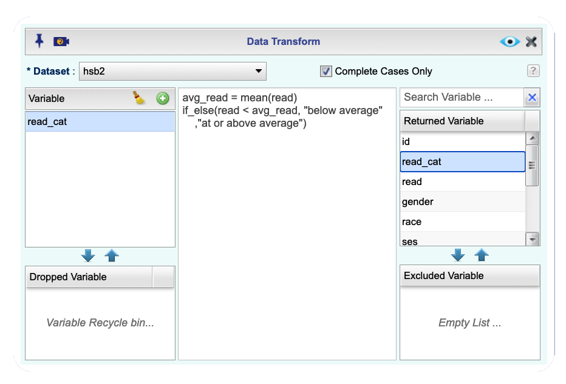
```

Now you see a dataset in Rguroo's **Dataset Viewer** that includes the newly formed variable `read_cat` and the other variables in the `hsb2` dataset. The values of this new variable are simple: if the reading score of the student is below the average reading score, the variable will have the label "below average", otherwise, the label will be "at or above average".

This discretization is accomplished using the `ifelse()` function in R:

- The first argument of the function is the logical test we wish to perform: `read < avg_read`.
- The second argument is what we want the function to do if the result of the logical test is `TRUE`. In other words, if the student's score is below the average score: `"below average"`.
- The third argument is what we want the function to do if the result of the logical test is `FALSE`. In other words, if the student's score is above the average score: `"at or above average"`.

Now you can save this dataset with a name such as `hsb2_read_cat`.

```{r, out.width='75%', fig.align='center', fig.cap='*Saving the new dataset as "hsb2_read_cat"*'}
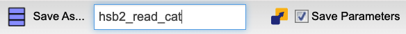
```


Next, it's your turn to discretize a different variable.

### New variable `num_char_cat` 

We'll create a categorical version of the `num_char` variable in the `email50` dataset. `num_char` is the number of characters in an email, in thousands. This new variable will have two levels (`"below median"` and `"at or above median"`) depending on whether an email has less than the median number of characters or equal to or more than that value. 

The median marks the 50th percentile, or midpoint, of a distribution, so half of the emails should fall in one category and the other half in the other. We will learn more about the median and other measures of center in the next tutorial in this series.

The `email50` dataset is available in your Rguroo account. Use the **Transform** function and similar steps as above to create the `num_char` variable. In the Transform function

-  Create a new variable (column) called `num_char_cat`, which discretizes the `num_char` variable into `"below median"` or `"at or above median"`.
- Find the median number of characters in emails, save the result to a variable named `med_num_char`. To find the median, use the R code $\color{darkblue}{\tt{median(num\_char)}}$.
- Use the $\color{darkblue}{\tt{ifelse()}}$ function to create `num_char_cat`. 
- Save the newly formed dataset with the name `email50_updated`.

Apply the `Dataset Summary` function in Rguroo to `email50_updated` to determine the number of emails in each level of `num_char_cat`. Evaluate whether these counts match the expected numbers.

## Combining levels of a factor

Sometimes we are interested in combining some of the levels of a factor variable. For example, the `email50` dataset has a categorical variable called `number` with levels `"none"`, `"small"`, and `"big"`, but suppose we're only interested in whether an email contains a number.  That is, we want to 
combine the levels `"some"` and `"big"` into one level labeled `"yes"`, and 
keep the `"none"` level separate as a level labeled `"no"`. There are three ways to combine levels of a factor variable in Rguroo. One way is to use the **Transform** function to create a new variable that combines the levels as desired; for example, create a new variable  `number_cat` that has levels `"yes"` and `"no"`, as described. A second way is to combine levels in Rguroo's **Level Editor**; we show this when visualizing data in a barplot. Yet a third way is to use Rguroo's **Variable Type Editor**. Here we will cover the first two methods.

### Using the Transform function

As noted earlier, in the `email50` dataset, the `number` variable has three levels, `"none"`, 
`"some"`, and `"big"`. We want to create a new variable (`number_cat`) that
combines the levels `"some"` and `"big"` into one level named `"yes"`, and 
keeps the `"none"` level separate as a level named `"no"`. This should sound
similar to how we used the `if_else()` function previously, where the logical
condition we want to check is whether the level of `number` is equal to
(`==`) `"none"`. So use the following steps in the **Transform** function to create the new variable `num_cat`:

- Open the `email50` dataset in the **Transform** function, and create a new variable called `number_cat`, which discretizes the `number` variable into `"no"` and `"yes"`.
- Use the ifelse function so that if the value of the `number` variable is `"none"`, you assign `"no`", and otherwise, you assign `"yes"` to the `number_cat` variable. That is 
   $\color{darkblue}{\tt{ifelse(number == "none",\  
                        "[VALUE\ IF\ TRUE]",\  
                        "[VALUE\ IF\ FALSE]")}}$
- Save the resulting dataset with the name `email50_updated2`. Note that we had created a dataset named `email50_updated` earlier, and in order not to overwrite that dataset we use the name `email50_updated2`.

### Visualizing the num_cat variable

We will use the Rguroo **Barplot** function to visualize the values of the variable `number_cat`. Use the following steps to create the barplot:

---

1. Open the **_Plots_** toolbox and click on the **Create Plot** dropdown .

2. Select `Barplot` from the dropdown menu. This opens the **Barplot** dialog (see the figure below).

3. From the `Dataset` dropdown, select `email50_updated2`.

4. From the `Factor 1` dropdown, select `number_cat`.

5. Click the Preview button . You will see a barplot of the variable `number_cat`.

---

```{r, out.width='80%', fig.align='center', fig.cap='*Using Rguroo\'s Barplot function to create a barplot of the variable number_cat*'}
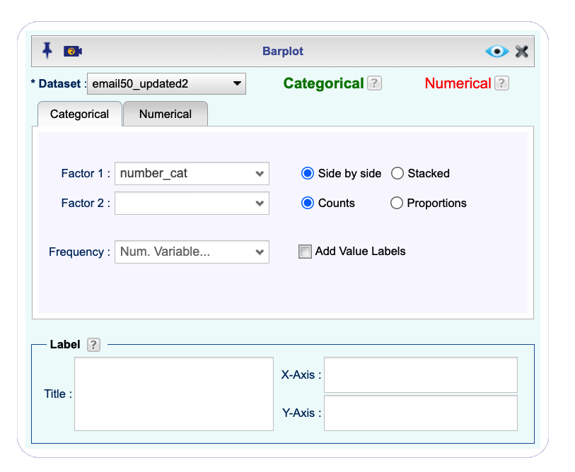
```

### Using Rguroo's Level Editor

In the previous section, we used the **Transform** function to create the new variable `number_cat` and the dataset `email_updated2` to combine the levels of the factor `number`. In Rguroo, you can use the **Level Editor** within a function to combine levels of a factor without creating a new variable or a new  dataset. For example, suppose that using the `email50` dataset, we want to, again, combine the levels `"some"` and `"big"` into one level labeled `"yes"` and 
keep the `"none"` level separate as a level labeled `"no"` when creating a barplot. Use the following steps to see how the **Level Editor** works:

---

1. Open the **_Plots_** toolbox and click on the **Create Plot** dropdown .

2. Select `Barplot` from the dropdown menu. This opens the **Barplot** dialog.

3. From the `Dataset` dropdown, select `email50`.

4. From the `Factor 1` dropdown, select the variable `number`.

5. Click on the **Level Editor** button . The **Factor Level Editor** dialog opens.

6. Use the following steps in the **Level Editor** to combine the levels of `big` and `small` (see the figure below):
  6.1 Select `number` from the `Factor` column. The levels of the `number` appear in the `Level` column.    
  6.2 Simultaneously select the levels `big` and `small` in the `Level` column.      
  6.3 In the `Label` textbox on the right column, type in $\color{darkblue}{\tt{yes}}$. This combines the levels `big` and `small` and labels the combined level `yes`.

7. Select the level `none` and in the `Label` textbox on the right column, type in  $\color{darkblue}{\tt{no}}$. This will relabel `none`e as `no` (see figure below).

8. Click the Preview button . You will see a barplot of the variable `number` with the combined levels `yes` and `no`.

---

```{r, out.width='90%', fig.align='center', fig.cap='*Using Rguroo\'s Level Editor to combine and relabel factor levels*'}
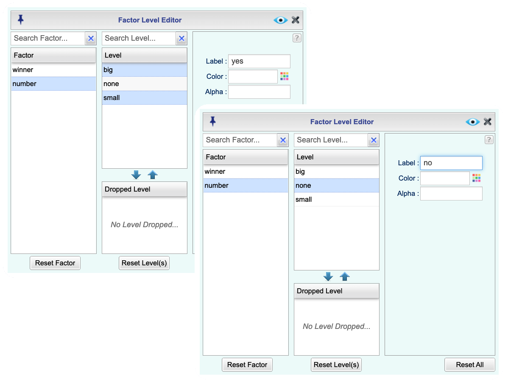
```

## Visualizing numerical data

The most logical and most useful first step of any data analysis is an exploratory analysis. And a very important and informative component of exploratory data analysis is visualization.

We will learn a lot more about data visualization in the tutorial on Summarizing and Visualizing Data, so we won't go into too much detail on data visualization in this tutorial. Let's, however, make a simple scatterplot to visualize the relationship between two numerical variables so that you can get some exposure to constructing plots in Rguroo and how to interpret them.

It is simple to make a basic plot in Rguroo. You can create a graph simply by selecting your graph type, selecting your dataset, choosing your variable(s), and clicking the `Preview` button . Fortunately, Rguroo has many options that can used easily to make sophisticated plots. Every plot includes a **Basics** dialog and a **Details** dialog that you can access by clicking on the  and  buttons. In the Details dialog, you have many options to customize each layer of your plot, including the axes, legends, etc. Here we will create a basic bivariate plot.

We'll visualize the relationship between the math and science scores of the students in the High School and Beyond dataset. Use the following steps to create the plot :


---

1. Open the **_Plots_** toolbox and click on the **Create Plot** dropdown  (see figure below).

2. Select `Scatterplot` from the dropdown menu. This opens the **Scatterplot** dialog.

3. From the `Predictor (x)` dropdown, select `science`.

4. From the `Response (y)` dropdown, select the variable `math`.

5. Click the Preview button . You will see a scatterplot of the variable `math` versus `science`.

---

```{r, out.width='70%', fig.align='center', fig.cap='*Using Rguroo\'s Scatterplot function to graph math versus science in hsb2 data *'}
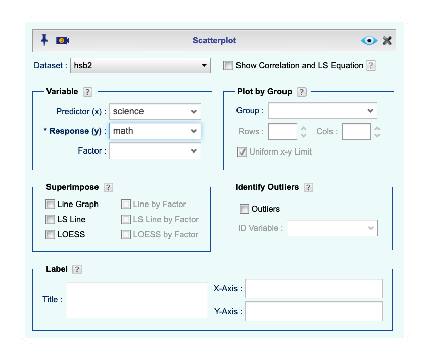
```

By right-clicking on a plot that you create in Rguroo, you can copy-paste it in other applications, for example, Word or Google Doc, or save it to your local computer. The default format of the plots in Rguroo is "SVG," standing for Scalable Vector Graphics. The advantage of using this format is that you won't lose resolution if you resize the plots. If you like to have your graphs in other formats such as png, jpeg, etc., you can change the format in the **Details** dialog.

You can also save your plot in Rguroo. Once you save a plot in Rguroo, it gets saved under the **Plots** toolbox area, and you can come back to it anytime. By simply double-clicking on the name, you get the dialog exactly where you left off, and you can modify your plot, if you wish. Let's save the scatterplot that we created with the name *"Math Vs Science"*. To do so, on the `Save As` textbox on top-right, type in $\color{darkblue}{\tt{Math\ Vs\ Science}}$.


### Interpreting a visualization

The following is the scatterplot of math versus science that you created. 

```{r, out.width='80%', fig.align='center', fig.cap='*Scatterplot of math versus science variables in hsb2 data *'}
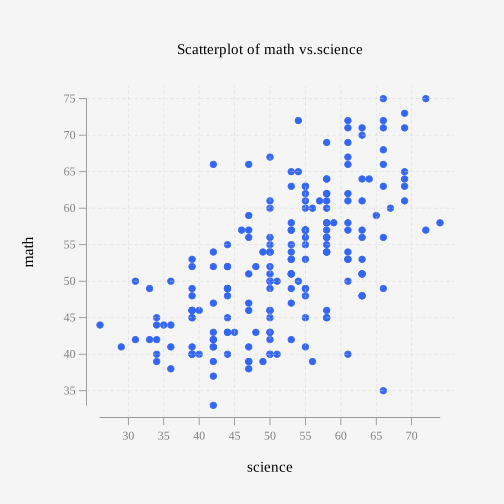
```


We can see that there is a positive relationship between the science and math scores of students, meaning that students who score highly in science tend to also score highly in math. Probably not that surprising a result.

Now, extending from bivariate to multivariate plots is easy in Rguroo. Let's test that out!

### Math, science, and program

Let's plot the same math and science test scores, but this time let's also consider the program that the student is in: general, academic, or vocational. Let's also add summarizing lines, called least squares or LS lines, to the plot.

We are going to continue from where we left off with the scatterplot in Rguroo, and follow steps 6 and 7 shown below. . If you still have the plot open, click on the  button to open the **Basics** dialog. If you have closed the graph, you can double-click on the name of the graph *"Math Vs Science"* that you saved your plot, and this will open the **Basics dialog. Of course, you can start from scratch and go through steps 1 to 5 above, and then continue with the following instructions.

---

6. In the `Factor` dropdown, select `prog`.

7. In the **Superimpose Section**, select the checkbox `LS Line by Factor`.

8. Click the **Preview** button .

---

As you can see in the figure below, Choosing the `prog` in the  `Factor` dropdown resulted in points on the scatterplot that distinguish the levels of the variable `prog`  by different colors and different plot characters. Checking the option `LS line by Factor` produces an LS line for each level of the selected factor.

```{r, out.width='70%', fig.align='center', fig.cap='*Using Rguroo\'s Scatterplot of math versus science by program for the hsb2 data *'}
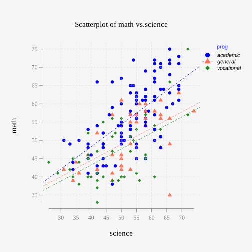
```

The same positive relationship between math and science scores is still apparent. But we can also see that students in academic programs, shown with blue points, tend to have higher math scores relative to their science scores than those in vocational programs, in green, and general programs, in orange.

We will wrap up this lesson with some practice creating a similar plot with different variables.

### Visualizing numerical and categorical data

Next, we'll visualize the relationship between two numerical variables from the `email50` dataset, separated by whether or not the email was spam. This means that we will use an aspect of the plot (like color and shape) to identify the levels in the `spam` variable so that we can compare plotted values between them.

If you open Rguroo's **Scatterplot** function and select the `email50` dataset, you won't see the variable `spam` in the `Factor` dropdown. This is because the variable `spam` is classified as a numerical variable having values of 0's and 1's; a 0 stands for "no," a 1 stands for "yes." So, we need to change the type of the variable `spam` from numerical to factor (categorical).

The **Variable Type Editor** function in Rguroo allows you to change the type of a variable from numerical to factor. Use the following steps to change the variable `spam` from numerical to factor:

---

1. Under the **Data** toolbox, right-click on the name of the  `email50` dataset. This opens a context menu. 

2. Select the **Variable Type Editor** option to open the **Variable Type Editor** (see figure below).

3. Select the variable `spam` from the `Numerical` column, and drag it to the `Factor/Categorical` column.

4. Click on the `Update` button.

5. Select the `spam` variable under the `Factor/Categorical` column. You will see the levels 0 and 1.

6. Double click next to 0 and 1 under the `Label` column, and type the labels $\color{darkblue}{\tt{no}}$ and $\color{darkblue}{\tt{yes}}$, respectively.
 
7. Click on the `Update` and `Close` buttons in that order.

---

```{r, out.width='90%', fig.align='center', fig.cap='*Using the Variable Type Editor to change the variable type of spam from numerical to factor *'}
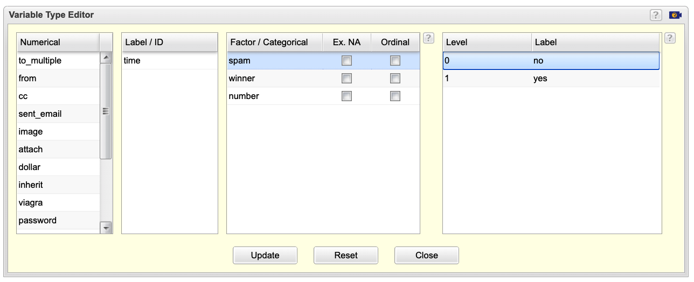
```

Now you are ready to draw the scatterplot!

- Create a scatterplot of number of exclamation points (`exclaim_mess`) on the y-axis vs. number of characters (`num_char`) on the x-axis.
- Color points by whether or not the email is `spam`. This is done automatically if you select the `spam` variable in the `Factor` dropdown.

(Optional) If you wish to change the color of the points for each level, you can click on the  button, select `spam`, and in the `Label & Color` section, select a color of your choice for each level. Also, if you like to reorder the levels yes and no, you can move the levels by drag and drop. You can explore other attributes that you can change in the **Level Editor**.

*Based on the plot, does there appear to be a relationship between these variables?* 

## Congratulations!

You have successfully completed Lesson 1 in Tutorial 1: Getting Started with Data.

What's next?

`r emo::ji("ledger")` [Full list of tutorials supporting OpenIntro::Introduction to Modern Statistics](https://openintrostat.github.io/ims-tutorials/)

`r emo::ji("spiral_notepad")` [Tutorial 1: Getting Started with Data](https://openintrostat.github.io/ims-tutorials/01-data/)

`r emo::ji("one")` [Tutorial 1 - Lesson 1: Language of data](https://openintro.shinyapps.io/ims-01-getting-started-with-data-01/)

`r emo::ji("two")` [Tutorial 1 - Lesson 2: Types of studies](https://openintro.shinyapps.io/ims-01-getting-started-with-data-02/)

`r emo::ji("three")` [Tutorial 1 - Lesson 3: Sampling strategies and Experimental design](https://openintro.shinyapps.io/ims-01-getting-started-with-data-03/)

`r emo::ji("four")` [Tutorial 1 - Lesson 4: Case study](https://openintro.shinyapps.io/ims-01-getting-started-with-data-04/)

`r emo::ji("open_book")` [Learn more at Introduction to Modern Statistics](http://openintro-ims.netlify.app/)
